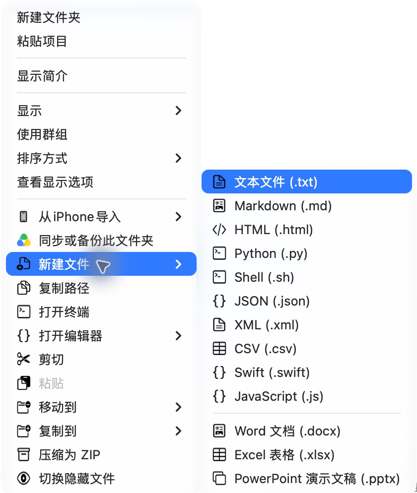
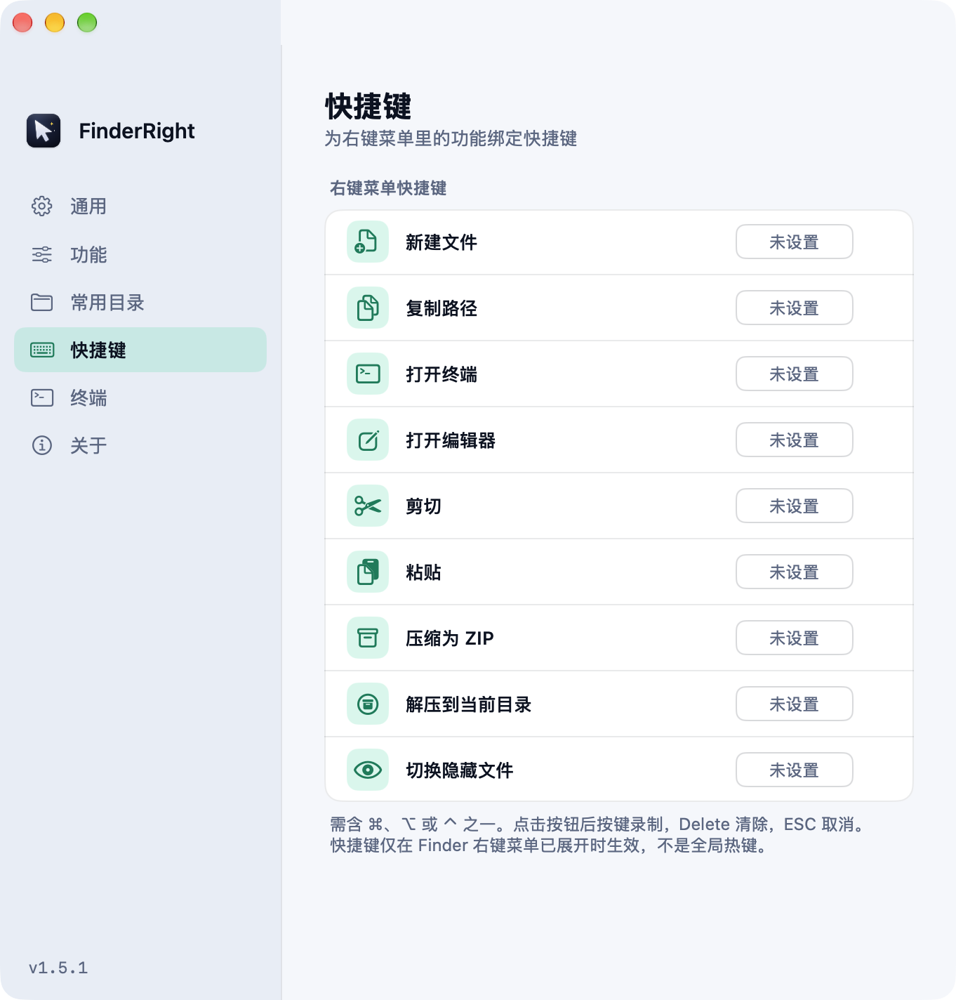
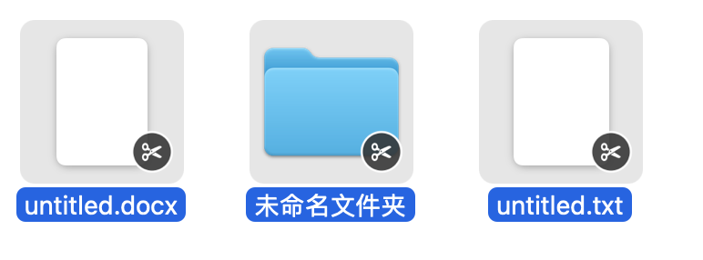

<div align="center">

# FinderRight

**给 Finder 加上右键新建文件、打开终端和剪切粘贴。**

**Create files, open a terminal, and cut & paste from Finder’s right-click menu.**

免费开源 · 文件操作在本地完成 / Free & open source · File operations stay on your Mac

[English](#english) · [中文](#中文)

-blue)


<br/>
<br/>


&emsp;


如果 FinderRight 让你的日常操作更顺手，欢迎 [⭐ 点个 Star 支持](https://github.com/funny-dog/FinderRight)，也欢迎反馈使用问题。

If FinderRight makes your daily work easier, [⭐ star the project on GitHub](https://github.com/funny-dog/FinderRight). Feedback is welcome too.

</div>

---

## 中文

给 Mac 的 Finder 加上右键新建文件、打开终端和剪切粘贴——免费开源，文件操作在本地完成。适合经常管理项目文件的 Mac 开发者。

### ✨ 功能

- 📄 **新建文件** —— 一键新建 txt / Markdown / Python / Shell / JSON / Swift / JS 等十种文件，以及空白的 Word / Excel / PowerPoint 文档；还可在设置中添加自定义文本模板
- 📋 **复制路径** —— 复制选中文件/文件夹的完整路径；可在设置中改为 `~` 路径、仅文件名、终端转义路径或文件 URL
- 📋 **复制文件名** —— 独立复制完整文件名（含扩展名），多选时每行一项
- 📂 **前往目录** —— 输入绝对路径或 `~/` 路径，在 Finder 中打开指定目录
- 💻 **打开终端** —— 在当前目录打开终端（支持系统默认终端，以及 Ghostty / Terminal / iTerm2 / Warp 等）
- ✏️ **打开编辑器** —— 用 VS Code / Cursor / Sublime / Xcode 等打开
- ✂️ **剪切 / 粘贴** —— Finder 原生没有的"剪切文件"，剪切后的文件带角标，粘贴时才真正移动
- 📁 **移动到 / 复制到** —— 在设置中添加常用目录后，右键即可把选中项移动或复制过去
- 📦 **压缩 / 解压** —— 压缩为 ZIP；选中压缩包可解压到当前目录（包内只有一个顶层文件夹时直接解出，不再套两层同名文件夹）
- 👁 **切换隐藏文件** —— 即时显示/隐藏隐藏文件，**不重启 Finder、窗口不闪烁**（需辅助功能权限）
- ⌨️ **自定义快捷键与顺序** —— 给每个菜单项绑定快捷键，并可在设置中拖动调整它们在右键菜单中的顺序
- 🌗 **中英文双语** —— 默认跟随系统语言；设置里的「语言」可强制中文 / English，右键菜单即时生效（角标文案需重启访达后生效）
- 🔐 **升级免重新授权** —— 自 1.3.0 起使用固定证书签名，之后的版本升级会自动保留「完全磁盘访问」与「辅助功能」授权；自动更新还会校验新版本与当前版本出自同一证书，拒绝被篡改或冒充的更新包

### 📸 截图

<p align="center">
  <br/>
  <sub>剪切后的文件带剪刀角标，粘贴时才真正移动</sub>
</p>

### 📥 安装

> ⚠️ **芯片架构说明**：当前版本仅支持 **Apple Silicon（M 系列芯片，ARM64）**，要求 macOS 13.0+，暂不支持 Intel 架构。

1. 下载 **[FinderRight.dmg](https://github.com/funny-dog/FinderRight/releases/latest/download/FinderRight.dmg)** —— 此链接始终指向最新 Release
2. 打开 DMG，把 `FinderRight.app` 拖到 `Applications`
3. **首次打开**（应用未经 Apple 公证，需手动放行）：
   ```bash
   xattr -dr com.apple.quarantine /Applications/FinderRight.app
   ```
   然后双击打开；或右键 → 打开 → 在弹窗中选择"打开"。
4. 启动后按引导：
   - **启用 Finder 扩展**：系统设置 → 隐私与安全性 → 扩展 → 访达扩展 → 勾选 FinderRight
   - **授予完全磁盘访问**（在受保护目录使用所有功能）
   - **授予辅助功能**（让"切换隐藏文件"不闪烁）

> ⚠️ 当前版本使用自签名证书签名，未经 Apple 公证，因此需要第 3 步手动放行。若未来提供 Developer ID 公证版，可省去第 3 步。

### 🔄 升级说明

可以通过应用内「关于」页面的自动更新直接升级，或手动下载最新版 `FinderRight.dmg` 拖入 `Applications` 覆盖。

> 💡 **版本升级注意事项**：
> 1. **重启访达（重要）**：macOS 系统会缓存 FinderSync 扩展进程。覆盖安装或更新后，**务必在终端执行以下命令重启访达**，以使系统加载最新版本的扩展插件（否则右键菜单或剪切角标可能不会即时刷新）：
>    ```bash
>    killall Finder
>    ```
> 2. **权限重新授权说明**：自改用固定的自签名证书签名起，新旧版本的签名身份相同，**「完全磁盘访问权限」与「辅助功能权限」在升级后会自动保留**。唯一的例外是从 **1.2.0 及更早版本**（Ad-hoc 签名，`codesign -s -`）**首次升级**到 1.3.0 或更新版本：macOS 的安全管控机制（TCC）会判定其为不同身份的程序，需要按下面的方法重新授权一次。此时系统设置里的开关可能看起来仍显示开启，但底层校验实际已失效。
>    - **完全磁盘访问**：前往「系统设置 → 隐私与安全性 → 完全磁盘访问权限」，将 FinderRight 的开关**关闭再重新开启**（或点 `-` 删除后重新拖入添加）。
>    - **辅助功能权限**：前往「系统设置 → 隐私与安全性 → 辅助功能」，选中 FinderRight 点击底部的 **`-`（减号）删除**，再重新打开应用添加即可。
>    - **终端一键重置法（推荐，最省心）**：
>      ```bash
>      tccutil reset SystemPolicyAllFiles com.finderright.app
>      tccutil reset Accessibility com.finderright.app
>      ```
>      执行后重新打开 FinderRight 即可按引导一次性勾选授权。
> 3. **先退出旧版**：若旧版正在后台运行，建议先在菜单栏点击图标选择「退出 FinderRight」后再拖动覆盖。
> 4. **解除拦截**：覆盖后若提示未公证拦截，请重新执行：
>    ```bash
>    xattr -dr com.apple.quarantine /Applications/FinderRight.app
>    ```

### 🗑️ 完全卸载

若需彻底清理应用及配置残留，可在终端执行：

```bash
killall FinderRight 2>/dev/null || true
rm -rf /Applications/FinderRight.app
rm -rf ~/Library/Application\ Support/FinderRight
rm -f ~/Library/Preferences/com.finderright.app.plist
tccutil reset All com.finderright.app 2>/dev/null || true
killall Finder
```

### 🛠 从源码构建

网站源码位于 [`website/`](website/)，预览与部署说明见该目录的 README。

方式一（推荐，无需 Xcode，仅需 Command Line Tools）：

```bash
bash scripts/setup-signing.sh  # 仅首次：生成自签名证书并导入钥匙串（发布构建必需，请备份私钥）
bash scripts/ci.sh             # 编译 Kit + 单元测试 + 主程序/扩展静态类型检查
bash scripts/build.sh          # 产出 FinderRight.app 与 DMG / ZIP（有证书时用证书签名，否则退回 ad-hoc）
```

方式二（Xcode 工程，需 Xcode 16+ 和 [xcodegen](https://github.com/yonaskolb/XcodeGen)）：

```bash
brew install xcodegen
xcodegen generate
xcodebuild -scheme FinderRight -configuration Release \
  -derivedDataPath build/release build
```

### ⚠️ 已知行为与取舍

- **后台操作结果看菜单栏**：压缩 / 解压 / 粘贴在提交给主 App 后立即返回「已受理」，不弹通知（以避免任何权限弹窗打扰）。结果会列在菜单栏图标的「最近操作」里：成功项点击可在访达中定位产物，失败项点击查看原因；有未查看的失败时菜单栏图标会变红。记录只保存在内存中，退出 App 即清空；若在设置中隐藏了菜单栏图标，则看不到这一提示。详细日志仍可在 Console.app 中搜索 FinderRightService。
- **加密 / 分卷压缩包**：系统 bsdtar 能解 `.7z` 与 `.rar`（含 RAR5），但加密或分卷的包会解压失败，失败原因见菜单栏「最近操作」（解压中途产生的临时文件会被自动清理）。
- **菜单生效范围**：Finder 扩展只注册用户主目录与已挂载卷；`/Applications`、`/Users/Shared` 等系统目录不会出现右键菜单，云盘目录改由「服务」子菜单提供（见下节）。
- **终端工作目录**：Ghostty / Alacritty / Kitty 只有在**尚未运行**时才能通过命令行参数指定工作目录（`open --args` 的固有限制）；已在运行时退化为目录 URL 方式，能否换目录取决于各终端自身实现。
- **剪切状态**：粘贴过程中若主 App 被强退/崩溃，下次启动会自动把未移动完的剪切路径恢复回队列（移动成功的不会回来）。

### 🏗 架构

- **主 App**（未沙箱）：菜单栏 + 设置界面，借用 TCC 权限执行实际文件操作
- **Finder 扩展**（沙箱）：负责右键菜单
- **IPC**：扩展通过"文件 + URL scheme"唤醒主 App 执行操作，无需 App Group / 付费开发者账号

### ☁️ iCloud / Google Drive 等云盘

iCloud Drive、Google Drive、OneDrive、Dropbox 等云盘在 macOS 上是 **File Provider 域**，系统只允许其自身扩展提供右键菜单，第三方 Finder 扩展无法在其中显示菜单（**与完全磁盘访问无关**）。因此在这些云盘文件夹里，FinderRight 的操作改为出现在 **右键 →「服务」子菜单**（选中文件后可用：复制路径 / 打开终端 / 打开编辑器 / 剪切 / 压缩 / 解压）。「新建文件」和空白处「粘贴」因没有选中项，无法走此路径。

### 📄 许可证

[MIT](LICENSE)

---

## English

Create files, open a terminal, and cut & paste from Finder’s right-click menu. FinderRight is free and open source, with file operations performed locally on your Mac. Built for Mac developers who work with project files every day.

### ✨ Features

- 📄 **New File** — create txt / Markdown / Python / Shell / JSON / Swift / JS and more with one click, plus blank Word / Excel / PowerPoint documents; add your own text templates in Settings
- 📋 **Copy Path** — copy the full path of selected files/folders; switch to a `~` path, file name only, shell-escaped path or file URL in Settings
- 📋 **Copy File Name** — copy full file names including extensions; multiple selections are copied one per line
- 📂 **Go to Folder** — enter an absolute path or a `~/` path to open the folder in Finder
- 💻 **Open in Terminal** — open the current folder in your default terminal, or choose Ghostty / Terminal / iTerm2 / Warp, etc.
- ✏️ **Open in Editor** — open with VS Code / Cursor / Sublime / Xcode, etc.
- ✂️ **Cut / Paste** — the "cut file" that Finder lacks natively; cut files get a badge and are only moved when you paste
- 📁 **Move To / Copy To** — add favorite folders in Settings, then move or copy the selection there from the right-click menu
- 📦 **Compress / Extract** — compress to ZIP; extract archives in place (an archive with a single top-level folder is extracted as that folder, not nested inside another one)
- 👁 **Toggle Hidden Files** — instantly show/hide hidden files **without restarting Finder or flickering** (needs Accessibility)
- ⌨️ **Custom Shortcuts and Order** — bind a keyboard shortcut to any menu item, and drag to reorder them in Settings
- 🌗 **Bilingual** — follows your system language by default; the in-app "Language" setting can force English / 简体中文 and applies to the context menu immediately (the badge label updates after Finder restarts)
- 🔐 **No Re-authorization on Upgrade** — signed with a fixed certificate since 1.3.0, so later upgrades keep the Full Disk Access and Accessibility permissions; the auto-updater also verifies that a new version is signed with the same certificate and rejects tampered or impostor packages

### 📸 Screenshots

<p align="center">
  <br/>
  <sub>Cut files get a scissors badge and are only moved when you paste</sub>
</p>

> The screenshots show the Chinese interface; FinderRight is also fully available in English.

### 📥 Installation

> ⚠️ **Architecture Requirement**: The pre-built release currently supports **Apple Silicon (M-series, ARM64)** Mac only, running macOS 13.0+. Intel (x86_64) architecture is not supported.

1. Download **[FinderRight.dmg](https://github.com/funny-dog/FinderRight/releases/latest/download/FinderRight.dmg)** — this link always points to the latest release
2. Open the DMG and drag `FinderRight.app` into `Applications`
3. **First launch** (the app is not notarized by Apple, so Gatekeeper must be bypassed):
   ```bash
   xattr -dr com.apple.quarantine /Applications/FinderRight.app
   ```
   Then double-click to open, or right-click → Open → choose "Open" in the dialog.
4. Follow the onboarding:
   - **Enable the Finder extension**: System Settings → Privacy & Security → Extensions → Finder Extensions → check FinderRight
   - **Grant Full Disk Access** (to use all features in protected folders)
   - **Grant Accessibility** (so "Toggle Hidden Files" doesn't flicker)

> ⚠️ This build is signed with a self-signed certificate and is not notarized by Apple, so step 3 is required. A Developer ID notarized build would remove step 3.

### 🔄 Upgrading from Older Versions

You can upgrade directly via the built-in auto-updater in the "About" tab, or manually download the latest `FinderRight.dmg` and drag `FinderRight.app` into `/Applications` to overwrite the existing version.

> 💡 **Upgrade Tips**:
> 1. **Restart Finder (Important)**: macOS caches FinderSync extension processes. After upgrading or overwriting the app, **always restart Finder via Terminal** to ensure the new extension bundle is loaded (otherwise the context menu or badges may not update immediately):
>    ```bash
>    killall Finder
>    ```
> 2. **Permission Re-authorization Notice**: Builds are now signed with a fixed self-signed certificate, so new versions keep the same code signing identity and **Full Disk Access and Accessibility permissions are preserved across updates**. The only exception is the **first update** from **1.2.0 or earlier** (ad-hoc signed, `codesign -s -`) to 1.3.0 or later: macOS Transparency, Consent, and Control (TCC) treats it as a different app, so re-grant the permissions once as described below, even if the toggle switches in System Settings still appear to be ON.
>    - **Full Disk Access**: Go to System Settings → Privacy & Security → Full Disk Access, toggle FinderRight OFF and back ON (or remove it with `-` and re-add).
>    - **Accessibility**: Go to System Settings → Privacy & Security → Accessibility, select FinderRight, click the **`-` (minus)** button to remove it, then restart the app to re-add.
>    - **One-click Terminal reset (Recommended)**:
>      ```bash
>      tccutil reset SystemPolicyAllFiles com.finderright.app
>      tccutil reset Accessibility com.finderright.app
>      ```
>      Then reopen FinderRight to complete the onboarding permission prompt.
> 3. **Quit the old version**: If running, select "Quit FinderRight" from the menu bar before overwriting.
> 4. **Bypass Gatekeeper**: Run:
>    ```bash
>    xattr -dr com.apple.quarantine /Applications/FinderRight.app
>    ```

### 🗑️ Complete Uninstall

To completely remove FinderRight and all associated preferences, staging files, and cache:

```bash
killall FinderRight 2>/dev/null || true
rm -rf /Applications/FinderRight.app
rm -rf ~/Library/Application\ Support/FinderRight
rm -f ~/Library/Preferences/com.finderright.app.plist
tccutil reset All com.finderright.app 2>/dev/null || true
killall Finder
```

### 🛠 Build from Source

Website source lives in [`website/`](website/); see its README for preview and deployment instructions.

Option 1 (recommended, no Xcode needed — Command Line Tools only):

```bash
bash scripts/setup-signing.sh  # first time only: create the self-signed certificate (required for release builds; back up the private key)
bash scripts/ci.sh             # build the Kit + unit tests + type-check app & extension
bash scripts/build.sh          # produces FinderRight.app plus DMG / ZIP (certificate-signed when available, otherwise ad-hoc)
```

Option 2 (Xcode project; requires Xcode 16+ and [xcodegen](https://github.com/yonaskolb/XcodeGen)):

```bash
brew install xcodegen
xcodegen generate
xcodebuild -scheme FinderRight -configuration Release \
  -derivedDataPath build/release build
```

### ⚠️ Known Behavior and Tradeoffs

- **Background results live in the menu bar**: compress / extract / paste acknowledge the request immediately ("accepted") and never post notifications (to avoid any permission prompt). Outcomes are listed under **Recent Activity** in the menu bar icon: click a success to reveal the output in Finder, or a failure to see why; the icon turns red while there are failures you haven't seen. The history is kept in memory only and is cleared when the app quits; if you hide the menu bar icon in Settings you won't see this indicator. Detailed logs are still available in Console.app (search `FinderRightService`).
- **Encrypted / multi-volume archives**: the system bsdtar handles `.7z` and `.rar` (including RAR5), but encrypted or split archives will fail; the reason shows up under Recent Activity in the menu bar (temporary files from the attempt are cleaned up automatically).
- **Menu coverage**: the Finder extension only registers your home folder and mounted volumes, so `/Applications`, `/Users/Shared` and similar system folders show no context menu; cloud folders are covered by the Services submenu (see below).
- **Terminal working directory**: Ghostty / Alacritty / Kitty can only receive a working directory through command-line arguments while they are **not yet running** (an inherent `open --args` limitation). If they are already running, FinderRight falls back to opening the folder URL, and whether the directory changes depends on the terminal itself.
- **Cut state**: if the main app is force-quit or crashes mid-paste, the paths that were not moved yet are restored into the cut queue on next launch (already-moved ones are not).

### 🏗 Architecture

- **Main app** (non-sandboxed): menu bar + settings UI, runs the actual file operations using its TCC permissions
- **Finder extension** (sandboxed): provides the right-click menu
- **IPC**: the extension wakes the main app via a file + URL scheme to perform actions — no App Group or paid developer account required

### ☁️ iCloud / Google Drive and other cloud folders

iCloud Drive, Google Drive, OneDrive, Dropbox and similar cloud storage are **File Provider domains** on macOS; the system only lets their own extension provide the right-click menu, so third-party Finder extensions can't show a menu there (**unrelated to Full Disk Access**). Inside these cloud folders, FinderRight's actions appear under **right-click → Services** instead (available with a file selected: Copy Path / Open in Terminal / Open in Editor / Cut / Compress / Extract). "New File" and pasting into empty space can't use this path since they have no selection.

### 📄 License

[MIT](LICENSE)
